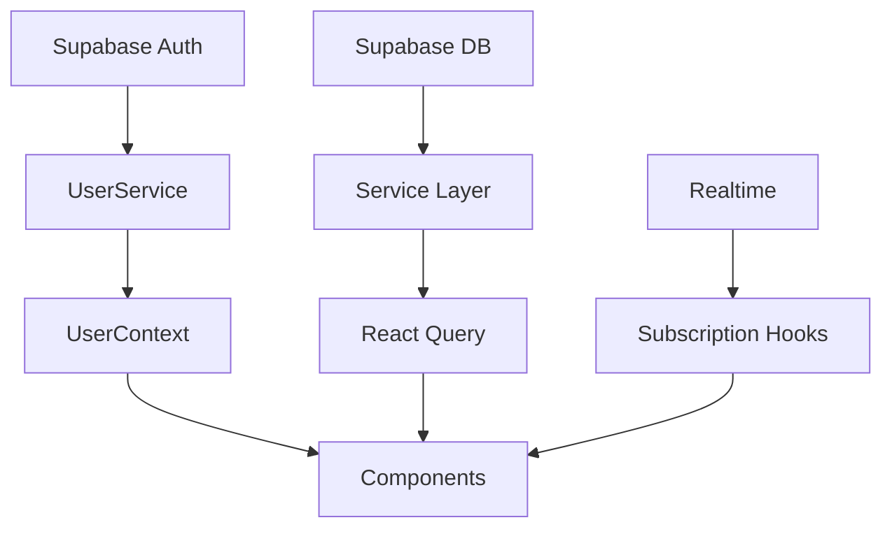

# Single Source of Truth Audit Report

## Executive Summary

This audit examines the codebase architecture to ensure proper "single source of truth" patterns and identify areas where data sources, logic, or state management may be duplicated or fragmented.

## Key Findings

### 1. **Multiple Supabase Client Instances**
- **Issue**: Found 161 instances of `createClient` calls across 58 files
- **Risk**: Potential for inconsistent client configurations and connection management
- **Recommendation**: Centralize client creation and reuse instances

### 2. **Wolfpack Service Fragmentation**
- **Issue**: Multiple Wolfpack service files with overlapping functionality:
  - `wolfpack.service.ts` - Basic service
  - `wolfpack-backend.service.ts` - Backend operations
  - `wolfpack-enhanced.service.ts` - Enhanced features
  - `wolfpack-auth.service.ts` - Authentication
  - `wolfpack-social.service.ts` - Social features
  - `wolfpack-membership.service.ts` - Membership management
  - `wolfpack-location.service.ts` - Location features
- **Risk**: Duplicate logic, inconsistent error handling, and maintenance challenges
- **Recommendation**: Consolidate into a single, well-organized service with clear module boundaries

### 3. **User Identity Confusion**
- **Issue**: Dual user ID system:
  - `auth.users.id` (Supabase Auth)
  - `public.users.id` (Application database)
- **Current Solution**: `UserService` properly manages this complexity
- **Recommendation**: Continue using `UserService` as the single source for user operations

### 4. **State Management Patterns**
- **Mixed Approaches**:
  - React Context (AuthContext, UserContext, NotificationContext)
  - React Query for server state
  - Local component state
  - Zustand (found in dependencies but usage unclear)
- **Recommendation**: Establish clear guidelines for when to use each pattern

### 5. **Database Schema Evolution**
- **Observation**: Multiple migrations show iterative fixes:
  - User profile handling
  - RLS policies
  - Notification constraints
- **Good Practice**: Using views (`profiles` view) for backward compatibility
- **Recommendation**: Document the canonical schema structure

## Architecture Strengths

### 1. **Clear Service Layer**
- Services properly encapsulate business logic
- Good separation between data access and UI components

### 2. **Type Safety**
- Comprehensive TypeScript types in `/types` directory
- Database types generated from Supabase schema

### 3. **Authentication Flow**
- Centralized auth handling through `AuthContext`
- Proper session management with SSR support

### 4. **Error Handling**
- Consistent error handling patterns in services
- User-friendly error messages with retry logic

## Recommendations for Single Source of Truth

### 1. **Consolidate Wolfpack Services**
```typescript
// Proposed structure: lib/services/wolfpack/index.ts
export class WolfpackService {
  // Core modules as private static classes
  private static auth = new WolfpackAuthModule();
  private static social = new WolfpackSocialModule();
  private static location = new WolfpackLocationModule();
  private static membership = new WolfpackMembershipModule();
  
  // Public API exposes unified interface
  static auth = this.auth;
  static social = this.social;
  // etc...
}
```

### 2. **Centralize Supabase Client Management**
```typescript
// lib/supabase/index.ts
export { createClient } from './client';
export { createServerClient, createAdminClient } from './server';

// Enforce single import point
// Use ESLint rule to prevent direct imports from ./client or ./server
```

### 3. **Establish State Management Guidelines**
```markdown
## State Management Rules
1. **Server State**: Use React Query (notifications, orders, user data)
2. **Auth State**: Use AuthContext (authentication status, session)
3. **UI State**: Use local component state (modals, form inputs)
4. **Global UI State**: Use Zustand (theme, layout preferences)
5. **User Profile**: Use UserContext (current user data)
```

### 4. **Create Data Flow Documentation**


### 5. **Implement Service Registry**
```typescript
// lib/services/registry.ts
class ServiceRegistry {
  private static services = new Map();
  
  static register(name: string, service: any) {
    if (this.services.has(name)) {
      console.warn(`Service ${name} already registered`);
    }
    this.services.set(name, service);
  }
  
  static get<T>(name: string): T {
    return this.services.get(name);
  }
}
```

## Action Items

1. **Immediate**:
   - Audit and consolidate Wolfpack service files
   - Create service layer documentation
   - Implement ESLint rules for import paths

2. **Short-term**:
   - Refactor components using multiple Supabase clients
   - Create unified error handling middleware
   - Document state management patterns

3. **Long-term**:
   - Consider implementing a service mesh pattern
   - Evaluate need for state management library consolidation
   - Create automated tests for data consistency

## Conclusion

The codebase shows good architectural patterns but suffers from service fragmentation and inconsistent client management. By consolidating services, centralizing client creation, and establishing clear state management guidelines, the application can achieve a true "single source of truth" architecture that is maintainable and scalable.